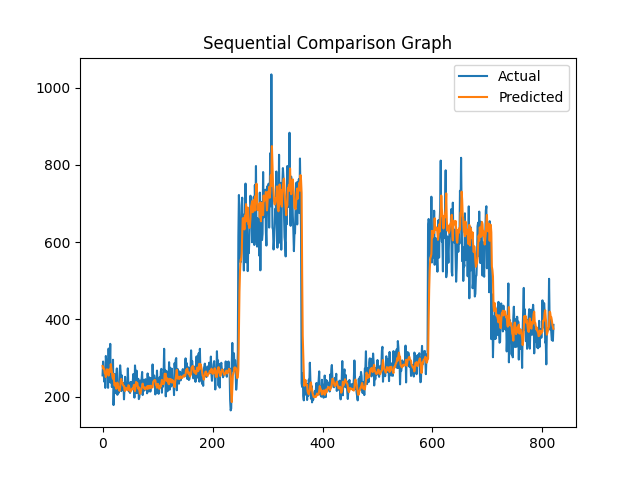

🌧️ Sequential Hybrid AIS → PSO – Rainfall Forecasting System
Advanced Time-Series Forecasting using LSTM + Hybrid Metaheuristic Optimization
🧭 Overview

This project builds an advanced Rainfall Forecasting System using:

LSTM Neural Networks for sequential time-series learning

Sequential Hybrid Optimization:

AIS (Artificial Immune System) → Exploratory search

PSO (Particle Swarm Optimization) → Refinement search

This hybrid framework improves the model's prediction accuracy by tuning hyperparameters automatically.

The system is trained using historical rainfall datasets and produces:

Trained model (.h5)

Scaler (.pkl)

Configuration (.yaml)

Predictions (.json)

Final results (.csv)

Visual graphs (.png)

📁 Project Folder Structure
Rainfall Forecasting/
│
├── archive/
│     ├── district wise rainfall normal.csv
│     ├── rainfall in india 1901-2015.csv
│
├── Sequential_rainfall_model.h5
├── Sequential_rainfall_scaler.pkl
├── Sequential_rainfall_config.yaml
├── Sequential_rainfall_prediction.json
├── Sequential_rainfall_result.csv
│
└── visuals/
      ├── Sequential_heatmap.png
      ├── Sequential_accuracy_graph.png
      ├── Sequential_loss_curve.png
      ├── Sequential_comparison_graph.png
      ├── Sequential_prediction_graph.png
      ├── Sequential_result_graph.png

🧠 Model Architecture
LSTM Network

2 LSTM layers (stacked)

Dropout regularization

Dense layers for final regression

Hyperparameters Optimized

LSTM units

Dense units

Dropout rate

Learning rate

Batch size

Loss Function
MSE (Mean Squared Error)

Optimizer
Adam

🔬 Sequential Hybrid Optimization Architecture
### 🟦 Stage 1 — AIS Optimization

AIS (Artificial Immune System) performs:

Mutation

Clonal expansion

Immune memory selection
➡ explores diverse solutions
➡ finds strong "base" parameters

🟩 Stage 2 — PSO Refinement

PSO (Particle Swarm Optimization):

Uses AIS best solution as starting particle

Refines parameters for lower RMSE

Moves particles towards global best

🎯 Final Goal

Obtain high-accuracy rainfall forecasting LSTM model with automatically optimized hyperparameters.

🗂️ Datasets Used
1. Rainfall in India (1901–2015)

Monthly rainfall records

Used as primary time-series input

2. District-wise Rainfall Normal

Reference data

Used for normalization consistency

Both datasets are stored in:

Rainfall Forecasting/archive/

⚙️ How the System Works
Step 1 — Load & Clean Data

Missing values handled using forward/backward fill

Monthly rainfall columns extracted

Dataset converted into a time-series sequence window (12 → 1 forecast)

Step 2 — AIS Optimization

Generate random population of parameter sets

Mutate one hyperparameter in each generation

Select best-performing solutions based on RMSE

Step 3 — PSO Optimization

Uses best AIS solution as initial "global best"

Particles update positions based on global best RMSE

Improved optimized parameter set found

Step 4 — Final Model Training

Train LSTM with optimized parameters for 30 epochs with validation split.

Step 5 — Prediction & Evaluation

Outputs:

Predicted rainfall

Actual rainfall

MAE / RMSE / R²

Step 6 — Save Results & Visuals

Saved inside:

Rainfall Forecasting/
Rainfall Forecasting/visuals/

📊 Visualizations Generated
Graph	Description
Sequential_heatmap.png	Correlation heatmap (Actual vs Predicted)
Sequential_accuracy_graph.png	Absolute error plot
Sequential_loss_curve.png	Squared error loss curve
Sequential_comparison_graph.png	Actual vs predicted plot
Sequential_prediction_graph.png	Only predicted values
Sequential_result_graph.png	Scatter plot of actual vs predicted

These provide full insight into the model's performance.

📌 Output Files Explained
File	Description
Sequential_rainfall_model.h5	Final trained LSTM model
Sequential_rainfall_scaler.pkl	Scaler used for normalization
Sequential_rainfall_config.yaml	Best hyperparameters from AIS→PSO
Sequential_rainfall_prediction.json	Predictions + actual values
Sequential_rainfall_result.csv	Actual vs predicted table

All outputs use the prefix:

Sequential_

🛠️ Technologies Used
Python

Pandas

NumPy

Matplotlib

Seaborn

Scikit-Learn

TensorFlow / Keras

Optimization Algorithms

AIS

PSO

Deep Learning

LSTM (Long Short-Term Memory)

🚀 How to Run the Project

Place your datasets in:

Rainfall Forecasting/archive/

Install dependencies:

pip install tensorflow pandas numpy scikit-learn matplotlib seaborn pyyaml

Run the Sequential Hybrid Optimization script.

Check results inside:

Rainfall Forecasting/
Rainfall Forecasting/visuals/

🟢 Why Sequential Hybrid Works Better?
Method	Strength
AIS	Strong global exploration (avoids local minima)
PSO	Fast convergence to best solution

Sequential AIS → PSO ensures:

Broad exploration

Precise refinement

Higher forecasting accuracy

🏁 Conclusion

This project delivers a highly optimized Rainfall Forecasting System combining:

Deep learning (LSTM)

Hybrid metaheuristic optimization

Clean visualization

Fully automated hyperparameter tuning
